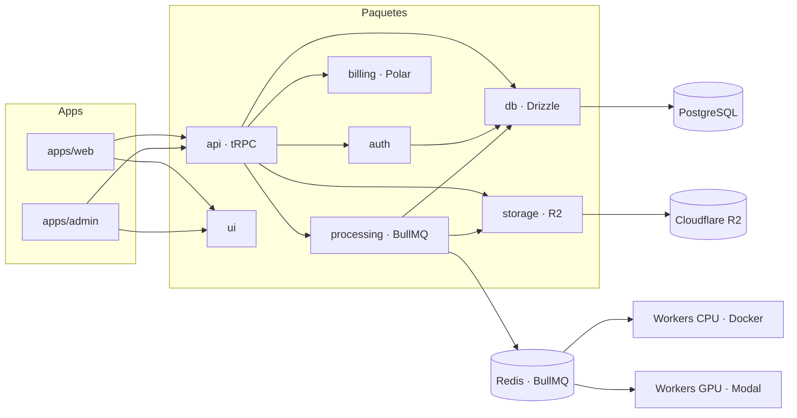
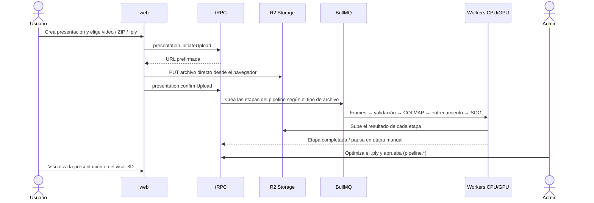

<div align="center">

# GSP · Gaussian Splatting Platform

**Plataforma web para crear, procesar, hospedar y visualizar escenas 3D con Gaussian Splatting.**

Subís un video o un set de fotos, el equipo lo procesa y obtenés una presentación 3D interactiva que podés compartir desde el navegador.

[](https://nextjs.org)
[](https://react.dev)
[](https://www.typescriptlang.org)
[](https://trpc.io)
[](https://orm.drizzle.team)
[](https://www.better-auth.com)
[](https://turborepo.com)
[](./LICENSE)

</div>

---

<!-- TODO: reemplazar por una captura o GIF real del visor 3D -->
<!--  -->

## ¿Qué es esto?

**Gaussian Splatting** es una técnica de reconstrucción 3D que, a partir de un video o un conjunto de fotos, genera una escena volumétrica que se puede recorrer en tiempo real en el navegador. GSP es un SaaS que envuelve ese flujo de punta a punta:

- **Para el usuario:** crea una organización, sube su material (video, ZIP de imágenes o un archivo `.ply` / `.splat` / `.sog` ya generado), sigue el estado del procesamiento y visualiza el resultado.
- **Por detrás:** un pipeline por etapas procesa el material automáticamente (extracción de frames, validación, COLMAP, entrenamiento de Gaussian Splatting, conversión a SOG) y se pausa en los pasos que requieren revisión humana.
- **Para el equipo de operaciones:** un panel de administración separado permite seguir cada etapa, reintentar o saltear pasos, subir archivos optimizados y aprobar la presentación final.

## Funcionalidades

| Área                          | Detalle                                                                                                                                                                                |
| ----------------------------- | -------------------------------------------------------------------------------------------------------------------------------------------------------------------------------------- |
| **Autenticación**             | Better Auth con email + contraseña, verificación de email y recuperación de contraseña vía Resend.                                                                                     |
| **Organizaciones**            | Multi-tenant: cada usuario puede crear organizaciones, invitar miembros y gestionar roles. Notificaciones de invitaciones en el header.                                                |
| **Presentaciones**            | Ciclo de vida completo: `draft → pending_review → approved → processing → completed`. Subida directa a almacenamiento S3/R2 mediante URLs prefirmadas.                                 |
| **Pipeline de procesamiento** | Orquestador sobre BullMQ + Redis con etapas automáticas y manuales. Workers CPU en Docker (frames, validación, SOG) y workers GPU en Modal (COLMAP, entrenamiento con Brush / gsplat). |
| **Visualizadores**            | Visor de Gaussian Splats basado en **Spark** sobre Three.js (formatos `.ply`, `.splat`, `.sog`), reproductor de video y explorador de ZIP.                                             |
| **Panel admin**               | App independiente con roles `admin` / `superadmin`: gestión de usuarios (ban, cambio de rol), organizaciones y cola de presentaciones.                                                 |
| **Facturación**               | Integración con Polar: checkout, portal del cliente, webhooks de suscripción y límites por plan (presentaciones, almacenamiento, miembros).                                            |
| **API tipada**                | tRPC v11 de punta a punta con procedures `public`, `protected`, `admin` y `superAdmin`.                                                                                                |

## Arquitectura

Monorepo con **pnpm workspaces + Turborepo**. Todo el código es TypeScript.

```text
apps/
├─ web/        Next.js 16 · App Router · aplicación principal (puerto 3000)
└─ admin/      Next.js 16 · panel de administración (puerto 3001)

packages/
├─ api/        Routers tRPC: auth, organization, presentation, pipeline, billing, admin
├─ auth/       Configuración de Better Auth (organizaciones, admin, emails)
├─ db/         Drizzle ORM + esquema PostgreSQL (auth, presentaciones, uploads)
├─ billing/    Cliente de Polar, planes, límites y manejo de webhooks
├─ storage/    Cliente S3 compatible (Cloudflare R2) con URLs prefirmadas
├─ processing/ Pipeline BullMQ: orquestador, workers TS, Dockerfiles y funciones Modal
├─ ui/         Componentes shadcn/ui + visualizadores 3D, video y ZIP
└─ validators/ Esquemas Zod compartidos

tooling/
└─ eslint · prettier · tailwind · typescript   Configuración compartida
```



### Flujo de una presentación



Etapas por tipo de archivo:

| Entrada           | Etapas                                                                                                                                    |
| ----------------- | ----------------------------------------------------------------------------------------------------------------------------------------- |
| Video             | `EXTRACT_FRAMES` → `VALIDATE_OVERLAP` → `COLMAP` → `BRUSH_TRAINING` → `OPTIMIZE_PLY` (manual) → `CONVERT_SOG` → `ADMIN_APPROVAL` (manual) |
| ZIP de imágenes   | `VALIDATE_OVERLAP` → `COLMAP` → `BRUSH_TRAINING` → `OPTIMIZE_PLY` (manual) → `CONVERT_SOG` → `ADMIN_APPROVAL` (manual)                    |
| `.ply` / `.splat` | `OPTIMIZE_PLY` (manual) → `CONVERT_SOG` → `ADMIN_APPROVAL` (manual)                                                                       |

El detalle de despliegue de los workers está en [`packages/processing/README.md`](./packages/processing/README.md).

## Puesta en marcha

### Requisitos

- Node.js 22 (ver `.nvmrc`)
- pnpm 10
- Docker (opcional, para PostgreSQL y Redis locales)

### Pasos

```bash
# 1. Instalar dependencias
pnpm i

# 2. Variables de entorno
cp .env.example .env
# Completar al menos POSTGRES_URL, AUTH_SECRET y RESEND_API_KEY

# 3. Levantar PostgreSQL y Redis en local
docker compose up -d

# 4. Aplicar el esquema a la base de datos
pnpm db:push

# 5. Correr las apps
pnpm dev:apps        # web en :3000 y admin en :3001

# 6. (Opcional) Correr los workers CPU del pipeline
pnpm -F @acme/processing start:cpu
```

Otros comandos útiles:

```bash
pnpm dev:web         # solo la app principal
pnpm dev:admin       # solo el panel admin
pnpm db:studio       # Drizzle Studio
pnpm auth:generate   # regenerar el esquema de auth tras cambiar la config
pnpm typecheck       # chequeo de tipos en todo el monorepo
pnpm lint            # ESLint
pnpm format          # Prettier
pnpm ui-add          # agregar componentes de shadcn/ui
```

### Variables de entorno

| Variable                                        | Descripción                                         |
| ----------------------------------------------- | --------------------------------------------------- |
| `POSTGRES_URL`                                  | Cadena de conexión a PostgreSQL.                    |
| `REDIS_URL`                                     | Conexión a Redis para BullMQ.                       |
| `AUTH_SECRET`                                   | Secreto de Better Auth (`openssl rand -base64 32`). |
| `AUTH_URL`                                      | URL base de la app para callbacks de auth.          |
| `RESEND_API_KEY`                                | API key de Resend para emails transaccionales.      |
| `POLAR_ACCESS_TOKEN` / `POLAR_WEBHOOK_SECRET`   | Credenciales de Polar para facturación.             |
| `STORAGE_*`                                     | Credenciales y bucket S3/R2 para los uploads.       |
| `NEXT_PUBLIC_APP_URL` / `NEXT_PUBLIC_ADMIN_URL` | URLs públicas de cada app.                          |

## Roadmap

- [x] Auth, organizaciones e invitaciones
- [x] Panel de administración con roles
- [x] Facturación con Polar y límites por plan
- [x] Ciclo de vida de presentaciones y uploads a R2
- [x] Visor de Gaussian Splats con Spark
- [x] Pipeline automático de procesamiento (frames, COLMAP, entrenamiento, SOG) sobre BullMQ y Modal
- [ ] Endurecer el pipeline: métricas, reintentos automáticos y límites de costo por organización
- [ ] OAuth con Google
- [ ] Páginas públicas de presentaciones compartibles
- [ ] Tests end-to-end

## Decisiones técnicas

- **Uploads directos al bucket** con URLs prefirmadas: el servidor nunca recibe el archivo, lo que mantiene la API liviana ante videos de varios GB.
- **Pipeline híbrido automático + manual:** cada etapa declara si es `AUTO` o `MANUAL`. Lo repetible corre solo y lo que requiere criterio (optimizar el `.ply`, aprobar) espera a un operador, sin duplicar lógica de estados.
- **Cómputo separado por costo:** los workers CPU corren en contenedores baratos y solo COLMAP y el entrenamiento van a GPU serverless en Modal, que se paga por segundo de uso.
- **Formato SOG para el visor:** el resultado final se convierte a SOG, un formato comprimido que reduce varias veces el peso respecto al `.ply` y hace viable la carga en el navegador.
- **Monorepo con paquetes chicos y explícitos** para que auth, storage y billing sean reemplazables sin arrastrar el resto.

## Licencia

[MIT](./LICENSE) © Juan Manuel Vila

> Basado inicialmente en [create-t3-turbo](https://github.com/t3-oss/create-t3-turbo).
